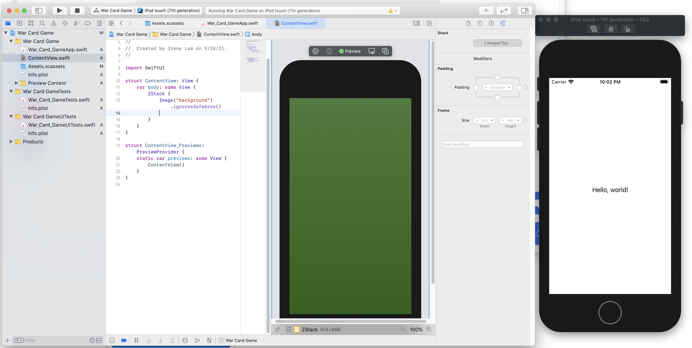

# Hack Technology / Project Attempted
## Irene Lam, Dartmouth CS98.01, Fall 2021

## What you built? 

### War Card Game

To get started, I built a card game in SwiftUI based on the game of War. In particular, two CPUs are dealt random cards and compete over who has the highest card. In the case of a tie, neither player's scores are incremented. This was my first time with SwiftUI, and while I briefly used Xcode previously, this was the first time I learned about the different features in Xcode, including everything from the inspector area to, my now personal favorite, the code preview (shown below). 

Working in Xcode: 

War Card Game project demo:

### Shopping Cart

The motivation of this project was to learn Typescript, Material UI, Styled Components and React-Query. To this end, I implemented an online shopping website, complete with a selection of items to browse through, the ability to add/remove item(s) from the cart, and totaling funcitonality that calculates the sum of all items in the cart. This was my first time working with Typescript and my second time working with Material UI.

### Google Maps

Lastly, I attempted to implement an interactive Google Maps in React that would more specifically show all of the different skateparks in Ottawa, Canada. I rarely work in backend API, and true to my worries, I was not able to see the website run in its entirety due to issues with making a Google Maps Javascript API key. I was, however, able to see a general map of New York (before I was kicked out due to authentication issues), which was my goal in trying to integrate maps functionality.

Setting up Google Maps Javascript API key:

Map integration:

## Who Did What?

I hacked at these projects alone!

## What you learned

As this was the last hack-a-thing, I decided to spread myself a bit thin and explore many of the tech stacks I have always been intrigued in and wanted to learn more about. I mainly focused on websites/ iOS development as I forsee both being popular final project mediums I would be interested in working with. With regards to the granular details of each: 
* **War Card Game:** I honestly learned a lot more about the Xcode interface than I expected for a SwiftUI tutorial. The tutorial was on the shorter side and relied a lot on images for its aesthetics. Because a lot was hardcoded (for a beginner app), the main issue I ran into was trying to fit the same content across devices of different sizes (e.g. the content was too spaced out for an iPod touch but perfect for an iPhone 11). I don't think I would choose SwiftUI for the final project as it limits users purely to those with iOS software, but needing to account for different screen sizes/ dimensions/ and functionality is definitely something I plan to prioritize if I choose to work on a mobile platform.
* **Shopping Cart:** I spent the bulk of my time on this hack, trying to work through documentation and learn about Typescript and Material UI. I'm a fan of Java's strong typing, and trying to follow the tutorial in Typescript confirmed my appreciation for this in that the code was very readable and generally easy to follow. I've worked briefly with Material UI in CS52, but it was only now that I realized how clean (and somewhat generic) an interface Material UI can create. Through this tutorial, I got to work with async, promises, JS array functions, and more. Organizing the project into the Cart, CartItem, and general Item also lent perspective to how dissecting elements often resulted in more concise code. Overall, I'm a fan of Typescript as a replacement/supplement to Javascript. I am, however, still flip-flopping on whether Material UI would be preferrable for the final project, because while it is convenient, this comes at the lack of innovation. 
* **Google Maps:** I chose to work with the Google Maps integration because location services are essential for many project ideas (e.g. finding missing people, locating a free court). I generally try to stick with frontend, so forcing myself to work with an API service was my main motivation. I unfortunately was not able to get the website properly running. The main issue I encountered was trying to set up the Google Maps Javascript API key. In particular, I believe that the issue was needing to put in billing information, only, every time I tried to, the system would require provider permission. As this was my first time working with the Google Maps API, I mainly relied on online resources, which became less helpful after a certain point. I definitely see value in working with backend API, and after this experience, understand that I should dedicate a lot more time and find resources if I plan to work with backend APIs on the final project. 
* **React Native Gestures and Animations:** I originally wasn't planning to include this project in my README analysis, but I figured I would after spending 3+ hours trying to get the app up and running. The tutorial is amazing -- it goes into great detail on transitions, animations, gestures, and SVG animations, and I learned a lot from the video irregardless of the app working (my main takeaway to animations being that its cleanliness is highly dependent on frames not dropping.) My main issue following this tutorial was that many of its dependencies were outdated. I initially tried to downgrade the dependencies in my repository to match that of the tutorial, only to realize that the documentation for these dated dependencies were largely missing. To this end, I couldn't learn more about these gestures/ animations and probably would not be comfortable using them in a final project either. I would still love to work with animations because it makes the user experience more fun, but it would be with more updated animations that supported multiple platforms (iOS and Android).

## Authors

Irene Lam (irene.x.lam.22@dartmouth.edu)

## Acknowledgments

[War Card Game](https://codewithchris.com/first-swiftui-app-tutorial/#more-234100)

[Shopping Cart](https://www.youtube.com/watch?v=sfmL6bGbiN8)

[Google Maps](https://www.youtube.com/watch?v=Pf7g32CwX_s)

[React Native Gestures and Animations](https://www.youtube.com/watch?v=wEVjaXK4sYQ)